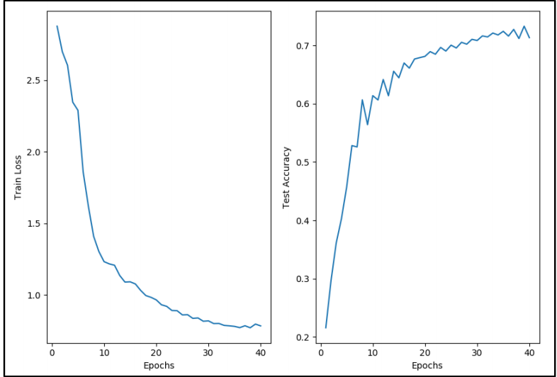

# Neural Network from Scratch

## Introduction
This repository contains code for Artificial Neural Network trained from scratch using NumPy. Scikit-Learn is used just for train-test split and finding accuracy score. To know how backpropogation works, check [this](https://youtu.be/tIeHLnjs5U8).

---
## Features
- Multilayer Neural Network (L Layers) 
- Multiclass Neural Network (N classes)
- Batching
- Cross-Entropy Loss with Softmax
- Stochastic Gradient Descent
- Three different type of activation functions
    * Sigmoid
    * ReLu
    * TanH
- Saving and Loading weights Functionality (Best accuracy weights will be saved)
- Prediction on Test data
- Argument Parser
- Training loss and test accuracy plots
---

## Dataset Used
[Fashion MNIST](https://github.com/zalandoresearch/fashion-mnist) dataset has been used. The dataset is included in this repository in Apparel directory.
The dataset contains 60,000 examples - each example is a 28x28 grayscale image, belonging to one of the 10 following class labels.
-    Class labels:
        | Label | Description
        | ----- | ----- |
            0 	T-shirt/top
            1	Trouser
            2	Pullover
            3	Dress
            4	Coat
            5	Sandal
            6	Shirt
            7	Sneaker
            8	Bag
            9	Ankle boot

### Represntation of images in the dataset:
The images are flattened to represent them as a row - each row consisting of 28*28 = 784 values. Each value reprsents a pixel of the image. To locate a pixel on the image, suppose that we have decomposed x as x = i * 28 + j, where i and j are integers between 0 and 27. The pixel is located on row i and column j of a 28 x 28 matrix. For example, pixel31 indicates the pixel that is in the fourth column from the left, and the second row from the top.

### Dataset format:
The first row represnts the heading. Rests are the examples.
Each row, having 785 columns, in the CSV file represents one example. The first column reprsents the label of the image. The rest of the 784 columns are the pixel values.
        
The sample dataset format:

label, pixel1, pixel2, pixel3, ..., pixel784
4,0,0,0,0,0,0,1,1,0,0,21,153,100,88,81,130,...,156
2,0,0,0,0,0,0,1,0,0,0,12,111,32,10,5,79,34,...,0
.
.
.

---
## How to run
```bash
git clone https://github.com/Pi-Rasp/Neural-Network-From-Scratch.git
cd Neural-Network-From-Scratch
mkdir Apparel
```

Download the Fashion MNIST dataset from [here (Google Drive)](https://drive.google.com/drive/folders/17qjjivM3rdCoxB9VHqC9qifbRMETDe2x?usp=share_link)
Unzip the downloaded file and keep ```apparel-test.csv``` and ```apparel-trainval.csv``` into the ```Apparel``` folder.

```bash
python3 neural_network.py --epochs 10 --num_classes 10 --activation_fn relu --hidden_layers [512, 256]
```
Hidden layer size can be set in a python list. For example ```--hidden layers [512, 256]``` means two hidden layers with 512 and 256 nodes respectively.

It will save the weights file named ```best_acc_weights.npy```. These weights are usable to predict the new test examples.
To load the weights file, the following command can be used:
```bash
python3 neural_network.py --epochs 10 --num_classes 10 --activation_fn relu --hidden_layers [512, 256] --weights best_acc_weights.npy
```

